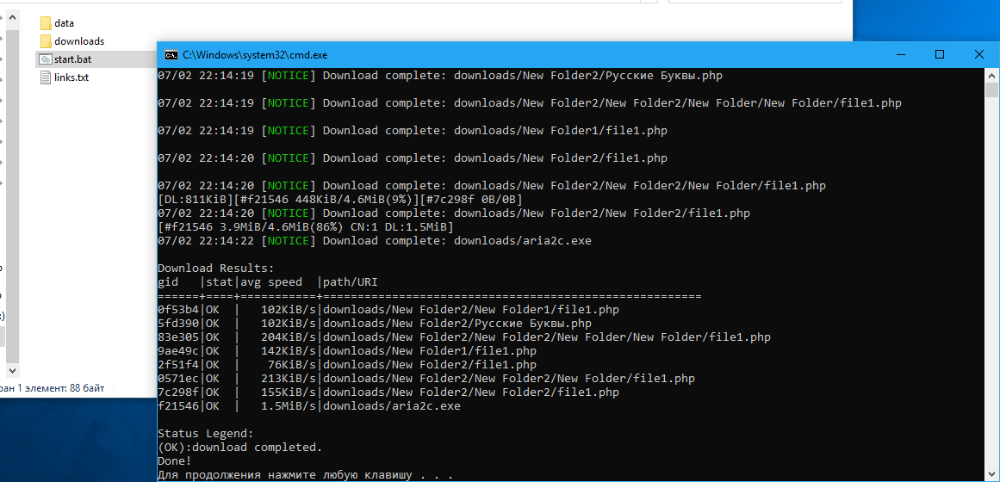

# Cloud&#64;Mail.Ru Downloader

Многопоточное скачивание из облака [Mail.Ru](http://cloud.mail.ru/) по публичной ссылки. Авторизация в Mail.Ru не требуется.

- Скрипт консольный, написан на PHP.
- Для скачивания используется консольный загрузчик [Aria2c](https://aria2.github.io/).
- Скрипт умеет корректно обрабатывать папки в облаке любой вложенности.
- Поддерживается докачка файлов.
- Для работы скрипта нужно установить php на компьютер, например отсюда http://windows.php.net/download/ (если уже установлен какой-нибудь Веб-сервер, например, [Denwer](http://www.denwer.ru/) или [OpenServer](http://open-server.ru/), то php от него тоже подойдет).
- Скрипт тестировался только на PHP версии *5.3.3* под Windows.

## Порядок работы

- В файл `links.txt` записать публичные ссылки на скачивание с облака вида https://cloud.mail.ru/public/4A7D/qjuSenWvG по одной на строку.
- В самом скрипте можно указать папку, куда будут скачиваться файлы, по-умолчанию это папка `downloads` рядом со скриптом.
- Запустить скрипт: `php cloud@mail.ru_downloader.php`
- Скрипт сформирует файл с прямыми ссылками на скачивание `input.txt`.
- После чего запустится Aria2c Downloader, который скачает файлы из `input.txt`.
- Остаётся наблюдать за закачкой и ждать её завершения.

***
#### Надеюсь этот скрипт Вам пригодится!